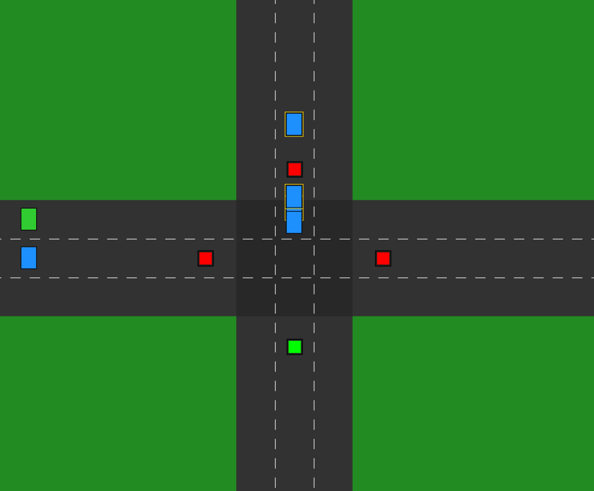

🚦<b> DSA-Queue-Simulator</b> 
This project simulates a four-way traffic junction using queue data structures and traffic light timing control. Vehicles are generated randomly in different lanes, stored in queues, and move through the junction based on the active green signal. The system demonstrates how queues help manage traffic flow, avoid congestion, and prioritize smooth vehicle movement at intersections.

<b>Project Demo</b> 
  

<b>Steps to run the program</b> 
   •Requirement: 
    -GCC compiler 
    -SDL2 
    
    •Compilation code: 
     -For traffic_generator.c:   gcc traffic_generator.c -o generator.exe  
     -For simulator.c:  gcc simulator.c queue.c priorityQueue.c -I"C:\Users\Sudha Karki\Downloads\Traffic Light\SDL2\include" -L"C:\Users\Sudha                                               Karki\Downloads\Traffic Light\SDL2\lib" -lmingw32 -lSDL2main -lSDL2 -o sim.exe 
     
    •To run: 
      -For traffic_Generator.c: ./generator 
      -For simulator.c: ./sim 

 <b> Key Features</b>

•Queue-Based & Efficient Traffic Management: 
 Vehicles are stored and processed using queue and circular buffer structures, enabling organized, efficient lane handling. 

•Automated Multi-Lane Signal Control: 
 Traffic lights switch automatically at fixed intervals, and vehicles move only when their respective road receives a green signal. 

•Real-Time Simulation with SDL2: 
 Roads, lanes, vehicles, and signals are visually rendered with real-time movement and continuous vehicle generation. 

•Extendable & Multithreaded System 
 Supports future priority / emergency lanes and uses a separate thread for smooth, continuous vehicle generation and processing.

📊<b>Data Structure</b>
| Data Structure  | Implementation | Purpose                                       |
|---------------- |----------------|-----------------------------------------------|
| Queue           | Circular Array | Store vehicles in each lane (12 queues total) |
| Priority Queue  | Min-Heap       | Manage road serving priority                  |
| Mutex Lock      | SDL_mutex      | Thread-safe queue operations                  |

🧩 <b>Algorithm Design</b> 
The algorithm used for processing traffic are 
• Vehicle Generation: 
  -Randomly generate vehicles in any lane at intervals (1 sec) 

• Traffic Light Control: 
  -Cycle through roads, one green light at a time, for LIGHT_DURATION 

• Vehicle Movement: 
 – Vehicles move only if their road’s light is green 
 – High-priority vehicles handled via priority queue if implemented 
 
• Queue Management: 
 – Vehicles enter lane queues in order 
 – Vehicles leave queue when they cross the junction. 

 ⏱️<b>Time Complexity Analysis</b>

• Enqueue / Dequeue (Queue): O(1) – constant time for adding/removing a vehicle 
• Queue Iteration for Movement: O(n) – iterate over all vehicles in a lane 
• Traffic Light Switching: O(1) – simple modulo arithmetic 
• Overall Complexity per Frame: O(total vehicles)

 

